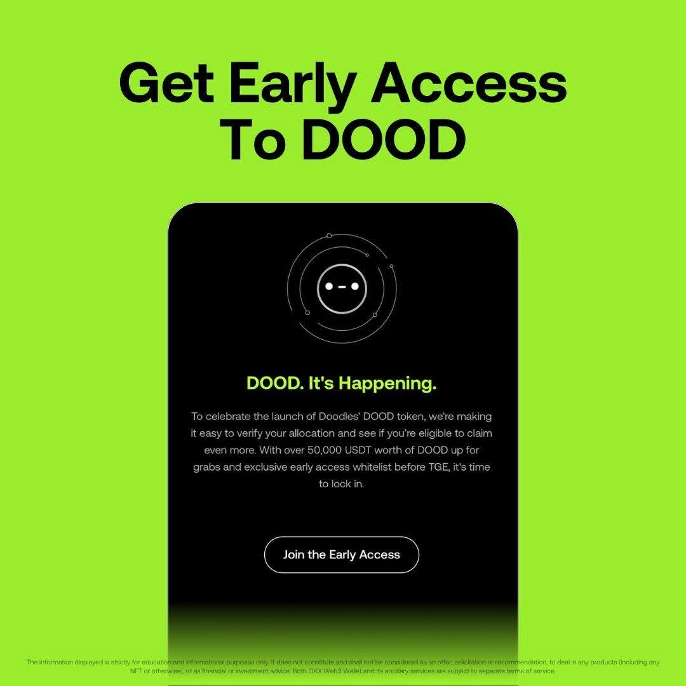
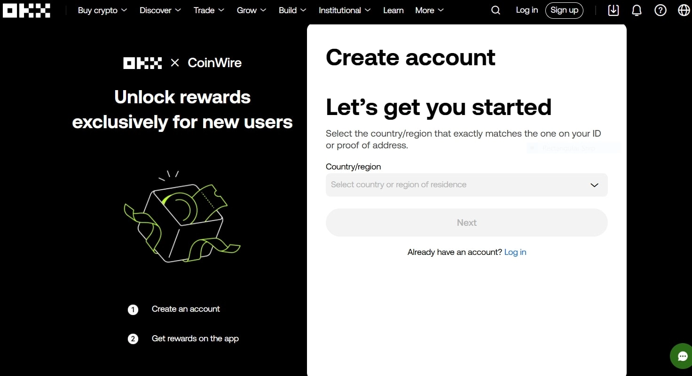

# OKX Web3 首发 Doodles 生态代币 $DOOD IDO——白名单用户限额 250 美元

---

去中心化交易越来越热,但真正能抢到优质项目首发额度的机会不多。OKX Web3 这次带来的 Doodles 生态代币 $DOOD,单用户最高能买 250 美元,而且只有一天时间。如果你手里有 Doodles NFT 或者愿意完成简单任务,现在就是拿到早期筹码的时候。

---

## 什么是 $DOOD IDO?

这是 OKX Web3 的第一次 IDO(初始 DEX 发行),主角是 Doodles NFT 项目的官方代币 $DOOD。整个活动叫 **"Dood. It's Happening"**(就是这么直白),限时一天,专门给白名单用户和 NFT 持有者留了提前买入的机会。

这次 IDO 是 OKX Web3 为了庆祝去中心化交易所(DEX)重新上线搞的大动作,把 Doodles 这个 Web3 老牌 IP 带到了代币市场。

## 代币销售细节

先说重点:

* **代币名称:** $DOOD(Doodles 生态)
* **IDO 时间:** 2025 年 5 月 8 日,香港时间晚上 10 点
* **购买限额:** 每个白名单用户最多买 250 美元的 $DOOD
* **代币领取:** 5 月 9 日晚上 9 点(香港时间)TGE 期间可领取
* **IDO 地点:** 待确认
* **TGE 地点:** Doodles 官方平台

销售只开放一天。想参与的话得抓紧时间搞定白名单资格,过了就没了。👉 [立即加入 OKX 参与 Doodles IDO,抢先布局 Web3 优质项目](https://www.okx.com/join/62834398)

## 谁能参加?

### 白名单(WL)资格获取方式

有两条路:

1. **持有 Doodles NFT**  
   如果你已经有 Doodles NFT,直接注册就能拿到白名单名额。记得在 5 月 8 日 UTC 时间晚上 10 点前完成注册。

2. **公开白名单活动**  
   没有 NFT 也没关系,完成社交媒体任务就有机会进公开白名单。中奖的话同样能买最多 250 美元的 $DOOD。

注意:白名单是 **先到先得**,而且 **不保证一定能分配到额度**——所以动作要快。

OKX 钱包官方公告在 [X(Twitter)上的链接](https://x.com/wallet/status/1920078402771656886)

## 卖完之后呢?

### 代币生成事件(TGE)

所有买到代币的白名单用户可以在 TGE 期间领取 $DOOD。同一天,$DOOD 也会在生态内开放交易。

## 交易大赛:瓜分 50,000 美元 USDT

从 5 月 9 日开始,$DOOD 持有者可以参加 **"Trade & Win Dood"** 交易大赛,这是在 OKX Web3 交易竞技场举办的活动。奖池总共有 **50,000 美元等值 USDT**,用 $DOOD 代币发放。

越早参加,冲进排行榜前列的机会越大。

## 怎么开始?

参与 $DOOD IDO 和交易活动的步骤:

1. 注册 OKX 账户(如果还没有的话)
2. 完成白名单资格获取(持有 NFT 或完成任务)
3. 5 月 8 日准时参与 IDO
4. 5 月 9 日 TGE 期间领取代币
5. 参加交易大赛,争取奖励

## 结语

这次 IDO 不只是把 Doodles 带进 Web3 代币市场,也说明 OKX 在去中心化融资领域的布局越来越深。对于 Web3 用户和 NFT 收藏者来说,这是个难得的早期参与机会——只有一天时间,动作要快。👉 [为什么 OKX 适合参与优质项目早期融资?因为它提供更透明的去中心化交易环境和更低的参与门槛](https://www.okx.com/join/62834398)
